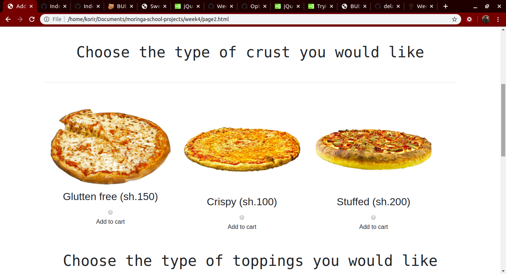

# Korir Pizza Plaza

#### This is a website that uses elements of HTML,CSS and Javascript in order for it to function as intended.It is a well designed website that interacts easily with the user.
##### Created by Chris Ruto.

## Description
Korir Pizza Plaza is a website that connects people to our pizza store and allows them to make an order of a pizza of their chioce.
We make it possible for you to get your food without the need of moving using your electronic device.

## Set Up
For you to start up you require:
- 8gb RAM
- 500gb
- Core i5

## Live link to webpage
You can use this link to access the website:
https://ckorir.github.io/Week4-IP/

## Contact Details
Email:
chrisruto.k@gmail.com

## License
You can get the license here:
https://github.com/ckorir/Week4-IP/blob/master/LICENSE

Copyright (c) {2020} Korir

## Screenshots

